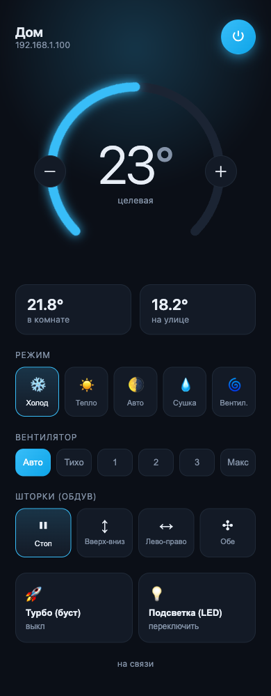
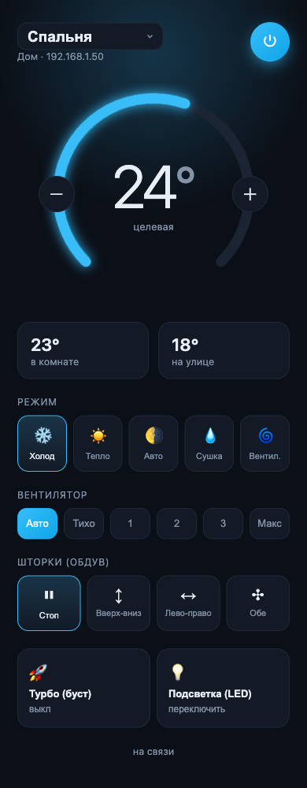

# midea-local-web

Веб-управление Wi-Fi кондиционерами **MDV / Midea** (и совместимыми OEM-брендами)
**по локальной сети, без облака и без родного приложения**. После однократного
получения `token`/`key` устройства серверы Midea больше не нужны.

Это **самостоятельный веб-пульт** (свой UI + REST API + Docker) — в отличие от
существующих решений, которые почти все являются интеграциями для Home Assistant.

<p align="center">
  
</p>

## Зачем это и в чём идея

Родное приложение MDV завязано на облако Midea. Когда облако/аккаунт сбоит —
кондей перестаёт управляться из приложения, хотя сам прекрасно работает в сети.
Этот репозиторий **полностью убирает облако из контура**: свой маленький сервер
в локальной сети говорит с кондеем напрямую по его же протоколу, а красивый
веб-пульт открывается с любого телефона/компьютера. Бонусом — несколько
кондеев в одном интерфейсе и возможность безопасно открыть доступ извне.

## Как это работает (MDV = Midea)

MDV — это OEM-бренд **Midea Group**, и Wi-Fi модуль («SmartKey») использует тот
же протокол, что и Midea. Он давно разобран сообществом, мы опираемся на
библиотеку [`msmart-ng`](https://github.com/mill1000/midea-msmart):

- **Обнаружение** — UDP-броадкаст на порт `6445` в локальной сети.
- **Управление** — зашифрованный TCP на порт `6444`.
- Современные модули (**протокол V3**) требуют пару `token` + `key` на каждое
  устройство. Её один раз получают через облако NetHome Plus (`msmart-ng` возит
  с собой публичные сервисные аккаунты, личный логин обычно не нужен), и дальше
  всё работает **локально без интернета**.

`token`/`key` — это и есть «ключ к протоколу». Скрипт `provision.py` достаёт их
автоматически и кладёт в `backend/devices.json`.

```
[браузер] ──HTTPS+токен──▶ reverse-proxy ──▶ FastAPI (:8000) ──LAN TCP:6444──▶ кондей
                                              + раздаёт React-UI с того же порта
```

- **Backend** — FastAPI (`backend/server.py`): REST API + раздача собранного фронта.
- **Frontend** — React/Vite (`web/`): пульт с выбором устройства.
- **Docker** — один образ (multi-stage: сборка фронта + рантайм бэкенда).

> ⚠️ **Важно про архитектуру.** Сервер общается с кондеем по локальной сети
> (TCP 6444 + UDP-discovery). Поэтому он должен стоять **в той же LAN, что и
> кондиционер**. Несколько точек = по серверу в каждой точке (или VPN-мост).

## Как найти свой кондей (если он MDV)

1. Кондей должен быть подключён к Wi-Fi (через родное приложение или режим
   точки доступа) и находиться в той же сети, что и сервер.
2. Запустите обнаружение:

   ```bash
   # в Docker:
   docker compose run --rm app python -m msmart.cli discover
   # или локально из venv:
   .venv/bin/msmart-ng discover
   ```

   Вы увидите `ip`, `id`, `version` (обычно V3) и `type` (`0xac` = кондиционер).
3. Если знаете IP — сразу заводите устройство скриптом (см. ниже), он сам всё
   обнаружит и получит ключи:

   ```bash
   docker compose run --rm app python provision.py --ip 192.168.X.Y --name "Дом"
   ```

> Не нашёлся? Проверьте: тот же сегмент сети (не гостевой Wi-Fi), кондей включён
> в Wi-Fi, на сервере есть исходящий интернет для получения `token`/`key`.

---

## Быстрый старт (Docker, рекомендуется)

Целевая машина: любой Linux-хост в одной сети с кондеем (мини-ПК, Raspberry Pi, NAS).

```bash
git clone <repo> && cd lan-condi

# 1. токен доступа к API
cp .env.example .env
sed -i "s/replace-with-long-random-token/$(openssl rand -hex 32)/" .env

# 2. список устройств: получаем token/key по IP кондея
cp backend/devices.example.json backend/devices.json   # или пустой []
docker compose run --rm app python provision.py --ip 192.168.X.Y --name "Дом"

# 3. запуск
docker compose up -d --build
```

Открыть `http://<ip-сервера>:8000`, ввести токен из `.env` — готово.

---

## Добавить ещё один кондиционер (по IP)

На сервере **той точки**, где стоит кондей (он должен быть в той же сети):

```bash
docker compose run --rm app python provision.py --ip 10.0.0.50 --name "Офис"
docker compose restart app
```

`provision.py` найдёт устройство, вытащит `token`/`key` из облака NetHome Plus,
проверит их реальной LAN-аутентификацией и допишет в `backend/devices.json`.
В интерфейсе появится переключатель устройств.

> Если кондей на удалённом статик-IP — запускайте `provision.py` именно на сервере
> в той сети, а не у себя. Управлять им потом можно через тот же удалённый сервер
> (см. «Публикация в интернет»).

---

## Публикация в интернет (статический IP)

Никогда не выставляйте голый HTTP наружу — токен утечёт. Минимум — TLS + токен.

**Вариант A. Свой домен + Caddy (авто-HTTPS):**
1. A-запись `ac.example.com → ваш-статик-IP`.
2. `cp Caddyfile.example Caddyfile`, поправьте домен.
3. Запустите Caddy (нативно или контейнером `caddy`), он проксирует на `127.0.0.1:8000`.
4. На роутере пробросьте 80/443 на сервер. Приложение наружу **не** публикуйте.

**Вариант B. Без проброса портов — Cloudflare Tunnel / Tailscale:**
туннель до `127.0.0.1:8000`, статический IP и открытые порты вообще не нужны.
Самый безопасный путь.

В обоих случаях `AC_API_TOKEN` обязателен — фронт спросит его при входе.

---

## Локальная разработка (без Docker)

```bash
# backend
python3 -m venv .venv && .venv/bin/pip install -r backend/requirements.txt
AC_DEVICES_FILE=backend/devices.json .venv/bin/uvicorn server:app \
    --app-dir backend --host 0.0.0.0 --port 8000

# frontend (отдельный терминал) — dev-сервер с проксированием /api на :8000
cd web && npm install && npm run dev      # http://localhost:5180
```

---

## Переменные окружения

| Переменная         | Назначение                                         | По умолчанию          |
|--------------------|----------------------------------------------------|-----------------------|
| `AC_API_TOKEN`     | токен для `/api/*`. Пусто = без авторизации        | —                     |
| `AC_DEVICES_FILE`  | путь к списку устройств                            | `backend/devices.json`|
| `AC_STATIC_DIR`    | каталог собранного фронта                          | `backend/static`      |

## API

| Метод | Путь                          | Назначение                    |
|-------|-------------------------------|-------------------------------|
| GET   | `/api/devices`                | список устройств              |
| GET   | `/api/devices/{id}/state`     | текущее состояние             |
| POST  | `/api/devices/{id}/set`       | команда (см. поля ниже)       |
| GET   | `/api/health`                 | проверка живости (без токена) |

Тело `POST /set` (любые поля опциональны):
`power` (bool), `mode` (COOL/HEAT/AUTO/DRY/FAN_ONLY), `target` (°C),
`fan` (AUTO/SILENT/LOW/MEDIUM/HIGH/MAX), `turbo` (bool),
`swing` (OFF/VERTICAL/HORIZONTAL/BOTH), `display` (любое значение = переключить LED).

```bash
curl -H "Authorization: Bearer $AC_API_TOKEN" \
     -H 'content-type: application/json' \
     -d '{"power":true,"mode":"COOL","target":22}' \
     http://localhost:8000/api/devices/<id>/set
```

## Безопасность

- `backend/devices.json` и `.env` — **секреты**, в `.gitignore`, не коммитить.
- Наружу — только через TLS-прокси/туннель, всегда с `AC_API_TOKEN`.
- Приложение в host-сети слушает порт хоста — закройте 8000 фаерволом, если
  снаружи ходите только через прокси.

## Заметки по железу

- Управление направлением лопастей **по секторам** (фикс. углы) этот блок
  анонсирует в таблице возможностей, но команду отвергает (`0x11`). Работает
  только режим качания (`swing`: OFF/Вверх-вниз/Лево-право/Обе).
- Состояние LED-подсветки блок не отдаёт — поэтому кнопка «переключить».

---

## Мультисайт: несколько точек за NAT (агент + центр)

Когда кондеи в **разных** сетях (офис, дом) за NAT, один центральный сервер
не может дотянуться внутрь чужой LAN. Решение — **агент сам открывает
исходящее WSS-соединение в центр** (как Cloudflare Tunnel / ngrok), проброс
портов в точках не нужен.

```
[браузер] ──HTTPS/Bearer──▶ ЦЕНТР (публичный, TLS)
                               ▲ WSS (агент держит исходящий сокет)
                  ┌────────────┴────────────┐
            [агент-office]             [агент-home]
            в LAN кондеев              в LAN кондеев
            └ TCP 6444 → кондеи        └ TCP 6444 → кондеи
```

- `backend/agent.py` — агент: локальный discovery/контроль + исходящий WSS в центр.
- `center/server.py` — центр: реестр агентов, маршрутизация команд (RPC по `req_id`),
  браузерный REST + **realtime по WSS** (`/api/ws`), раздача UI.
- В пульте кондеи **группируются по точкам** (Офис/Дом), состояние обновляется
  вживую без поллинга.

<p align="center">
  
</p>

**Поднять центр** (на публичном хосте с TLS):
```bash
AC_API_TOKEN=<браузерный> AGENT_TOKEN=<секрет агентов> \
  docker compose -f docker-compose.multisite.yml up -d --build
```

**Добавить точку** — поднять агент в её сети (он сам зарегается в центре):
```bash
cp backend/devices.example.json backend/devices.json
docker compose -f docker-compose.agent.yml run --rm --entrypoint "" agent \
  python provision.py --ip <IP_кондея> --name "<Имя>"
echo "AGENT_TOKEN=<секрет агентов>" > .env
AGENT_ID=home CENTER_WS_URL=wss://<домен-центра>/agent/ws \
  docker compose -f docker-compose.agent.yml up -d --build
```

ENV центра: `AC_API_TOKEN` (браузер), `AGENT_TOKEN` (агент↔центр),
`POLL_INTERVAL` (период realtime-опроса, сек). ENV агента: `CENTER_WS_URL`,
`AGENT_ID`, `AGENT_TOKEN`.

---

## Альтернативы

Большинство существующих проектов — это интеграции для Home Assistant или
библиотеки, а не самостоятельный веб-пульт:

- [midea_ac_lan](https://github.com/wuwentao/midea_ac_lan) — интеграция для Home Assistant.
- [midea-ac-py](https://github.com/mill1000/midea-ac-py) — интеграция для Home Assistant.
- [midea-beautiful-air](https://github.com/nbogojevic/midea-beautiful-air) — Python-библиотека.
- [node-mideahvac](https://github.com/reneklootwijk/node-mideahvac) — Node.js + лучшая документация по протоколу.

Берите этот проект, если нужен **готовый веб-интерфейс под Docker без Home Assistant**.

## Благодарности

Локальный протокол реализован поверх [`msmart-ng`](https://github.com/mill1000/midea-msmart)
(mill1000) — спасибо сообществу за реверс протокола Midea.

## Лицензия

[MIT](LICENSE).
